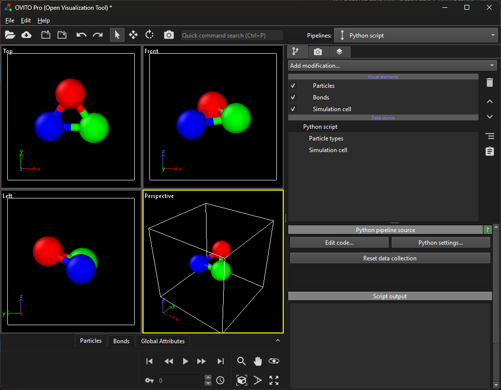

# Reset Viewport View
A small utility that resets the camera position in the active viewport to match the default perspective view when starting a new OVITO session. 



## Installation
- OVITO Pro [integrated Python interpreter](https://docs.ovito.org/python/introduction/installation.html#ovito-pro-integrated-interpreter):
  ```
  ovitos -m pip install --user git+https://github.com/nnn911/ResetViewportView.git
  ``` 
  The `--user` option is recommended and [installs the package in the user's site directory](https://pip.pypa.io/en/stable/user_guide/#user-installs).

- Other Python interpreters or Conda environments:
  ```
  pip install git+https://github.com/nnn911/ResetViewportView.git
  ```

## Technical information / dependencies
- Tested on OVITO version 3.12.0

## Contact
Daniel Utt utt@ovito.org
